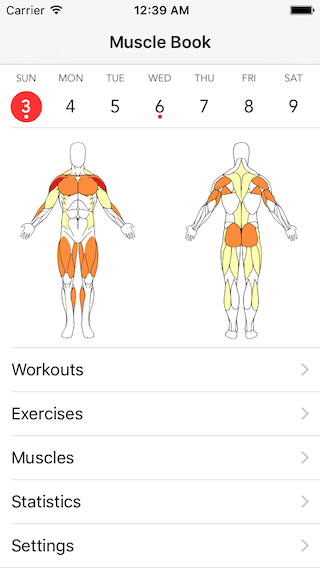

# Muscle Book

Muscle Book is an iOS workout tracker for strength training and body building.

The focus is on enabling the knowledgeable lifter to make decisions about future workouts by providing detailed data and visualizations based on workout history.

This app is not targeted at beginner lifters, but there is no reason a beginner should avoid using this application.

**This software is a work in progress, expect bugs.**

## Features

- Workout data entry
- Musculature visualizations
- Export to CSV
- Track personal records (PRs)
- [Estimated one-rep max](http://www.exrx.net/Calculators/OneRepMax.html) (e1RM)
- Exercise search
- Muscle & muscle groups browser
- Workout summary
- Supports multiple workouts per day
- Calendar week view
- Multiple time zone support
- Works offline, no network connection required
- Simple YAML format for custom exercises

## Non-Goals

Muscle Book aims to be a useful tool for all lifters regardless of routine, lifting style or goal. To that end, here is a list of functionality that is intentionally excluded from the scope of the project:

1. Workout planning
2. Suggestions or coaching
3. Routine-specific features
4. Anything that requires a centralized server
5. Non-strength or muscle related features (running, etc...)
6. Weight/exercise Goals

### Note About Artwork

I got the artwork for the anatomy visualization from [an old DeviantArt post](http://predator5791.deviantart.com/art/Interactive-Muscular-Anatomy-145463634). The terms of use are not clear and I have not had any success contacting the artist. If you are an artist and want to help contribute, please consider providing similar artwork under a compatible free license.

## License

This program is free software: you can redistribute it and/or modify
it under the terms of the GNU General Public License as published by
the Free Software Foundation, either version 3 of the License, or
(at your option) any later version.

This program is distributed in the hope that it will be useful,
but WITHOUT ANY WARRANTY; without even the implied warranty of
MERCHANTABILITY or FITNESS FOR A PARTICULAR PURPOSE.  See the
GNU General Public License for more details.

You should have received a copy of the GNU General Public License
along with this program.  If not, see <http://www.gnu.org/licenses/>.