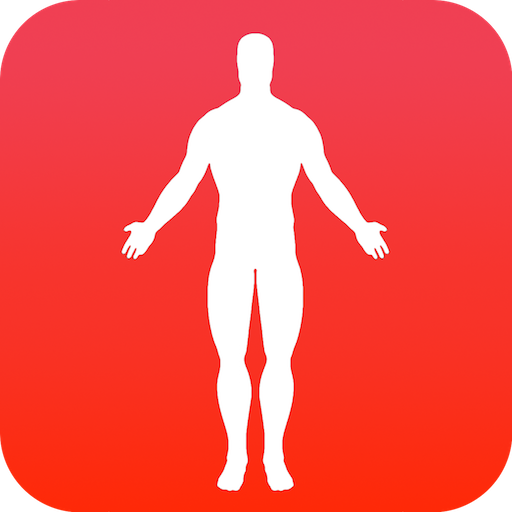
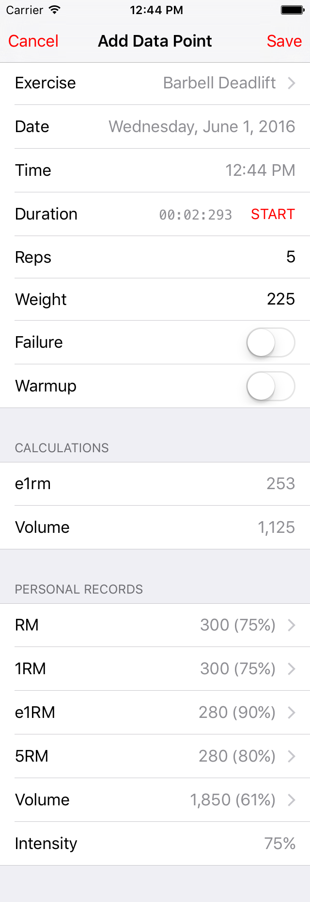
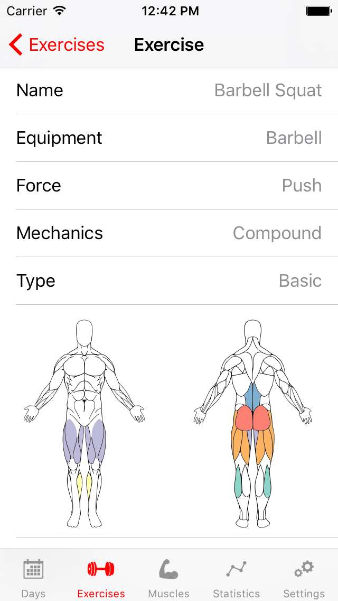
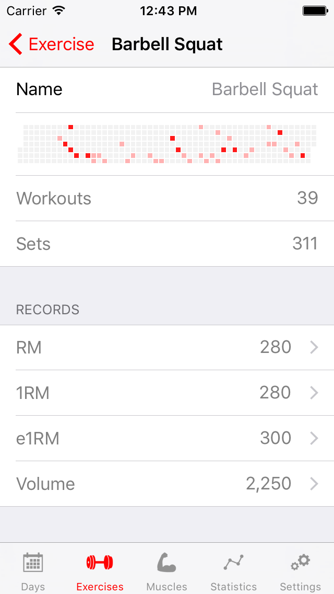

# MuscleBook.app

#### *This project has been abandoned, it is no longer maintained, and likely won't build anymore. Muscle book now lives on as a web app: [MuscleBook.net](https://github.com/cfilipov/MuscleBook.net)*

* * *

Muscle Book is an iOS workout tracker for strength training and body building. This app is not targeted at beginner lifters, but there is no reason a beginner should avoid using this application.

## Features

- Simple workout data entry supporting reps, sets, weight, duration, warmup and failure sets
- Musculature visualizations
- Intensity and volume calculations
- Export to CSV *(currently broken in 0.0.1)*
- Track personal records (PRs): 1RM, e1RM, xRM
- Calculate and track [Estimated one-rep max](http://www.exrx.net/Calculators/OneRepMax.html) (e1RM)
- Exercise search
- Muscle & muscle groups browser
- Workout summary
- Github-style punchcard graph
- Days since last workout and days since last rest day counters
- Supports multiple workouts per day
- Calendar week view
- Proper time zone support (important for people who travel)
- Works offline, *no network connection required*

## Installation

This app is not available on the App Store so it can only be installed by manually sideloading it using Xcode. You will need al least some basic familiarity with Xcode and the provisioning process.

After you clone the project, make sure you also init the submodules.

	$ git clone https://github.com/cfilipov/MuscleBook.git
	$ cd MuscleBook
	$ git submodule update --init --recursive

## Non-Goals

Muscle Book aims to be a useful tool for all lifters regardless of routine, lifting style or goal. To that end, here is a list of functionality that is intentionally excluded from the scope of the project:

1. Workout planning
2. Suggestions or coaching
3. Routine-specific features
4. Anything that requires a centralized server
5. Non-strength or muscle related features (running, etc...)
6. Weight/exercise Goals

## Changes

A list of changes can be found in the [CHANGELOG](CHANGELOG.md).

## Contributing

Contributions are very welcome. You don't need to know how to program to contribute to this project. Check out the [Contributions](CONTRIBUTING.md) page for more details.

## License

This program is free software: you can redistribute it and/or modify
it under the terms of the GNU General Public License as published by
the Free Software Foundation, either version 3 of the License, or
(at your option) any later version.

This program is distributed in the hope that it will be useful,
but WITHOUT ANY WARRANTY; without even the implied warranty of
MERCHANTABILITY or FITNESS FOR A PARTICULAR PURPOSE.  See the
GNU General Public License for more details.

You should have received a copy of the GNU General Public License
along with this program.  If not, see <http://www.gnu.org/licenses/>.
